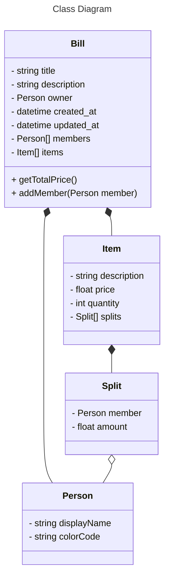

# sblitz-billing-service

| ID  | Requirement Name                                                    | Category | Acceptance Criteria |
| --- | ------------------------------------------------------------------- | -------- | ------------------- |
| 01  | As a User, I want to view all my Bills                              | Bill     |                     |
| 02  | As a User, I want to create a new Bill                              | Bill     | -                   |
| 03  | As a User, I want to add an existing Friend to a Bill               | Bill     | -                   |
| 04  | As a User, I want to add a custom Friend to a Bill                  | Bill     | -                   |
| 05  | As a User, I want to add a new Item in a Bill                       | Bill     | -                   |
| 06  | As a User, I want to assign an Item to any Friend added to the Bill | Bill     | -                   |

# Diagrams



```mermaid
---
title: ERD
---
erDiagram
    BILLS {
        string id PK
        string title
        string description
        uuid created_by FK "References MEMBERS(id)"
        float total_amount
        datetime created_at
        datetime updated_at
    }

    BILL_ITEMS {
        string id PK
        int bill_id FK "References BILLS(id)"
        string name
        string split_type
        float price
    }

    MEMBERS {
        id uuid
        bill_id integer REFERENCES BILLS(id)"
        color_code text
        PRIMARY_KEY(id, bill_id)
    }

    SPLIT {
        string id PK
        int bill_item_id FK "References BILL_ITEMS(id)"
        uuid assignee_id FK "References MEMBERS(id)"
        number amount
    }

    BILLS ||--|{ BILL_ITEMS : "has"
    BILLS ||--|{ MEMBERS : "includes"
    BILL_ITEMS ||--|{ SPLIT : "assigned to"
```

Note:

- Default splitType is EQUAL
- splitType can be Amount/Percent/Share, and will only be displayed on client side
- If splitType is changed, the splitValue is set to 0 for all
