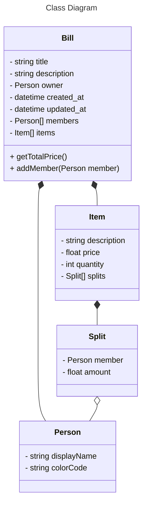
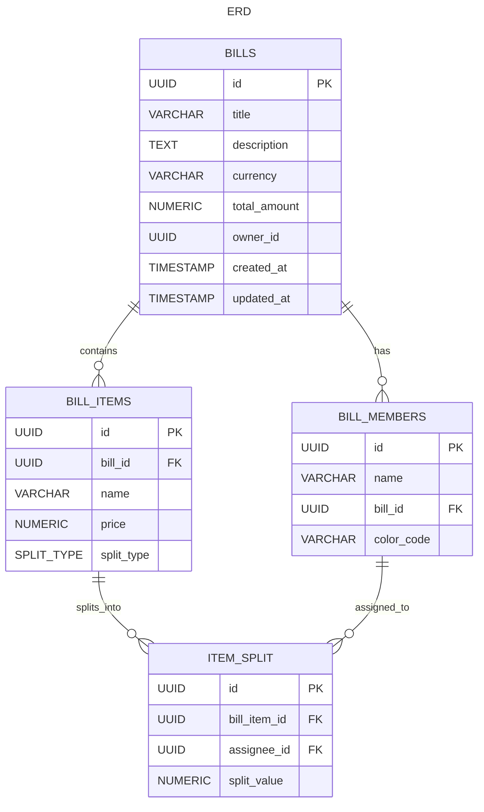

# sblitz-billing-service

| ID  | Requirement Name                                                    | Category | Acceptance Criteria |
| --- | ------------------------------------------------------------------- | -------- | ------------------- |
| 01  | As a User, I want to view all my Bills                              | Bill     |                     |
| 02  | As a User, I want to create a new Bill                              | Bill     | -                   |
| 03  | As a User, I want to add an existing Friend to a Bill               | Bill     | -                   |
| 04  | As a User, I want to add a custom Friend to a Bill                  | Bill     | -                   |
| 05  | As a User, I want to add a new Item in a Bill                       | Bill     | -                   |
| 06  | As a User, I want to assign an Item to any Friend added to the Bill | Bill     | -                   |

# Diagrams

Note:

- Default splitType is EQUAL
- splitType can be Amount/Percent/Share, and will only be displayed on client side
- If splitType is changed, the splitValue is set to 0 for all
